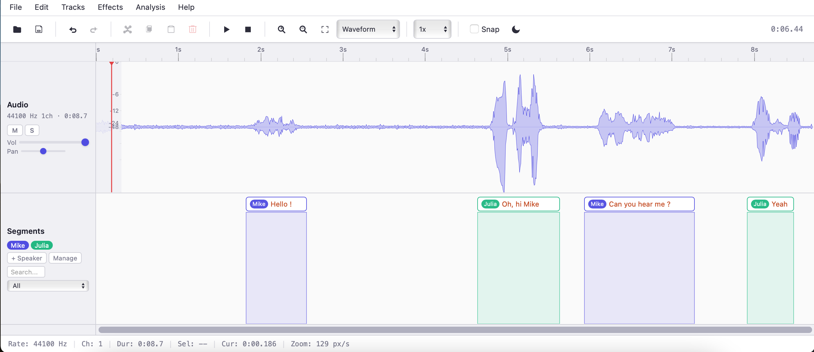

# Annota - Audacity-Style Web Audio Editor

A fully client-side, browser-based audio and video annotation tool inspired by Audacity. Built with TypeScript and bundled with Vite. No backend, no server-side processing -- all audio editing happens in your browser. Supports local audio/video files, remote URLs, and YouTube videos.



## Quick Start

You need **Node.js 22+** and **npm** to run this app.

```bash
# Install dependencies
npm install

# Start the development server
npm run dev
```

Then open **http://localhost:5173** in your browser. That's it.

### Production Build

```bash
npm run build
```

This outputs a `dist/` folder with optimized, minified assets. You can serve it with any static file server:

```bash
npx serve dist
```

### Type Checking

```bash
npm run typecheck
```

## Features

### Core Audio & Video Loading
- **Load audio files**: WAV, MP3, OGG, FLAC, M4A, AAC, WebM via file picker or drag-and-drop
- **Load video files**: MP4, WebM — audio track is extracted for waveform display, video shown in a floating or inline preview panel
- **Load from URL**: Fetch audio or video from a remote URL with download progress reporting
- **YouTube integration**: Load YouTube videos for annotation (supports `youtube.com/watch?v=`, `youtu.be/`, `youtube.com/shorts/`, bare video IDs, and URLs with playlist parameters)
- **Playback controls**: Play, Pause, Stop with spacebar shortcut
- **Playback speed**: 0.5x, 0.75x, 1x, 1.25x, 1.5x, 2x (also synced to video and YouTube player)
- **Time selection**: Click and drag to select audio regions
- **Cut / Copy / Paste / Duplicate / Delete**: Full clipboard operations on audio segments
- **Export audio**: Export selection or full file as WAV or MP3, with optional resampling and mono mixdown
- **Concatenation**: Append audio files end-to-end
- **Multi-track**: Load parallel audio tracks with independent controls

### Visualization
- **Waveform view**: Peak-cached rendering with hierarchical mipmap for instant zoom
- **Spectrogram view**: STFT-based frequency display with magma colormap, correct Nyquist frequency range
- **Video preview**: Floating draggable panel or inline display for video files and YouTube
- **dB scale overlay**: Amplitude scale on the left edge in waveform mode
- **Frequency scale overlay**: Hz scale on the left edge in spectrogram mode (up to actual Nyquist)
- **Time ruler**: Adaptive tick marks with time labels
- **Zoom**: Ctrl+scroll (smooth trackpad support with delta accumulation), +/- buttons, or Fit to view
- **Dark / Light theme**: Toggle with theme-aware canvas rendering for all views

### Audio Effects
- **Fade In / Fade Out**: Linear, exponential, or S-curve fades on selection
- **Normalize**: Peak normalize to -1 dBFS (whole file or selection)
- **Adjust Gain**: Apply dB gain adjustment
- **Parametric EQ**: Multi-band equalizer with visual frequency response curve
- **Compressor / Limiter**: Threshold, ratio, attack, release, knee, makeup gain
- **Reverb**: Room size, damping, wet/dry mix
- **Noise Reduction**: Two-step profile-based spectral noise gate
- **Speed / Pitch Change**: Resample-based speed adjustment (0.25x - 4x)
- **Saturation**: Soft clipping distortion (tanh waveshaper)
- **Resample**: Change sample rate (8kHz - 48kHz)

### Analysis
- **Spectrum Analysis**: Welch's method power spectrum (Hann window, 4096-point FFT, averaged magnitude in dB) with log/linear frequency axis
- **Spectrogram Analysis**: View spectrogram of selected region in a floating panel
- **Mel Filterbank**: Compute and display mel-scale filterbank energies
- **MFCC**: Compute and display Mel-frequency cepstral coefficients
- **Save as Image**: Export any analysis panel view as PNG

### Segment Track (Annotations)
- **Region segments**: Drag on the segment track to create a time range annotation
- **Point segments**: Click on the segment track to add a timestamp marker
- **Edit text**: Double-click a segment to rename it
- **Categories**: Assign segments to categories (speech, noise, music, silence, other)
- **Speaker system**: Assign speakers to segments with color-coded badges (8-color palette)
- **Speaker management**: Add, remove, rename, recolor, and merge speakers via a dedicated dialog
- **Split / Merge**: Split segments at cursor (Ctrl+T), merge adjacent segments
- **Search & filter**: Find segments by text or filter by category
- **Drag & resize**: Move segments or resize region edges (clamped to audio duration)
- **Export formats**: Audacity .txt, JSON, SRT, WebVTT, STM, TSV, ELAN XML (7 formats)
- **Import formats**: Audacity .txt, JSON, SRT, WebVTT (auto-detected)
- **TSV column picker**: Choose which columns to include in TSV export (start, end, speaker, text, category, duration)

### Channel Operations
- **Split Stereo to Mono**: Split a stereo track into two independent mono tracks
- **Combine to Stereo**: Combine two mono tracks into a single stereo track (choose left/right channels)
- **Mix and Render**: Mix all unmuted tracks down to a single mono track

### Track Combining
- **Combine Tracks**: Mix multiple tracks together with adjustable balance
- **Loop shorter track**: Optionally loop the shorter track to fill the longer track's duration
- **Volume preview**: Preview volume levels before combining
- **Output modes**: Mixdown (single track) or Separate (keep as individual tracks)

### Per-Track Controls
- **Volume slider**: Adjust gain per track
- **Pan slider**: Stereo panning per track
- **Mute (M)**: Silence individual tracks
- **Solo (S)**: Isolate individual tracks
- **Resizable track heights**: Drag the bottom edge of any track (audio or segments) to resize vertically
- **Mixdown export**: Mix all unmuted tracks to a single WAV file

### Project Management
- **Save/Load projects**: Persist full project state (audio + segments + speakers + viewport) via IndexedDB
- **Auto-save**: Automatic background saves every 30 seconds
- **Undo/Redo**: Up to 30 levels of undo history for destructive operations
- **Migration**: Automatically migrates old label-based projects to the new segment system

### Menu Bar

| Menu | Items |
|------|-------|
| File | New Project, Open Project, Save Project, Import Audio, Load from URL, Load YouTube Video, Import Segments, Export Audio, Export Segments, Export Mixdown, Export Waveform Image |
| Edit | Undo, Redo, Cut, Copy, Paste, Duplicate, Delete, Select All, Deselect, Reset Audio |
| Tracks | Add Audio Track, Append Audio, Separate Channels, Split Stereo to Mono, Combine to Stereo, Mix and Render, Combine Tracks, Manage Speakers, Add Segment, Resample Track |
| Effects | Fade In/Out, Normalize, Gain, Noise Reduction, Reverb, Saturation, EQ, Compressor, Speed/Pitch |
| Analysis | Spectrum, Spectrogram, Filterbank (Mel), MFCC, Save Analysis Image |
| Help | Keyboard Shortcuts, About |

### Keyboard Shortcuts

| Shortcut | Action |
|----------|--------|
| Space | Play / Pause |
| Ctrl+O | Load file (audio or video) |
| Ctrl+S | Save project |
| Ctrl+Z | Undo |
| Ctrl+Shift+Z / Ctrl+Y | Redo |
| Ctrl+X | Cut selection |
| Ctrl+C | Copy selection |
| Ctrl+V | Paste at cursor |
| Ctrl+D | Duplicate selection |
| Ctrl+A | Select all |
| Ctrl+B | Add segment |
| Ctrl+T | Split segment at cursor |
| Ctrl+= | Zoom in |
| Ctrl+- | Zoom out |
| Ctrl+F | Fit to view |
| Ctrl+U | Load from URL |
| V | Toggle video preview (floating / inline / hidden) |
| M | Toggle mute on main track |
| Delete | Delete selected audio or segment |
| Home / End | Jump to start / end |
| Arrow Left/Right | Scroll |
| Esc | Deselect / Close dialog |

## Architecture

### File Structure

```
Annota/
├── index.html              # Layout, toolbar, dialogs, canvas elements
├── styles.css              # Light/dark themes, flexbox layout, all UI styles
├── package.json            # npm scripts: dev, build, typecheck
├── tsconfig.json           # TypeScript strict mode config
├── vite.config.ts          # Vite build config
├── docs/
│   └── documentation.tex   # Full LaTeX documentation (compiles to PDF)
└── src/
    ├── types.ts            # Shared interfaces and type definitions
    ├── utils.ts            # Time formatting, color maps, HiDPI canvas setup
    ├── fft.ts              # Radix-2 Cooley-Tukey FFT + window functions
    ├── viewport.ts         # Zoom/scroll state, coordinate transforms, smooth trackpad zoom
    ├── undo.ts             # Undo/redo stack with AudioBuffer snapshots
    ├── audio-engine.ts     # Web Audio API: decode, play, edit, encode WAV, load from ArrayBuffer
    ├── waveform.ts         # Mipmap peak cache + theme-aware rendering
    ├── spectrogram.ts      # STFT computation + rendering
    ├── timeline.ts         # Time ruler with adaptive ticks
    ├── selection.ts        # Selection overlay + playback cursor
    ├── segment-track.ts    # Segment model, rendering, speaker badges, import/export (7 formats)
    ├── speaker-manager.ts  # Speaker CRUD, merge, color palette management
    ├── clipboard.ts        # Cut/copy/paste for audio and segments
    ├── resampler.ts        # Sample rate conversion
    ├── effects.ts          # Core audio effects (fade, normalize, gain)
    ├── worker.ts           # Self-contained Web Worker for STFT + peaks
    ├── effects/
    │   ├── eq.ts           # Parametric equalizer (biquad cascade)
    │   ├── compressor.ts   # Dynamics compressor with soft knee
    │   ├── reverb.ts       # Algorithmic reverb
    │   ├── noise-reduction.ts  # Spectral noise gate
    │   └── time-stretch.ts     # Speed/pitch change
    ├── analysis/
    │   ├── filterbank.ts   # Mel filterbank computation
    │   ├── mfcc.ts         # MFCC extraction
    │   └── spectrum.ts     # Welch's method power spectrum analysis + rendering
    ├── ui/
    │   ├── icons.ts        # SVG icon strings
    │   ├── context-menu.ts # Right-click context menu (with speaker assignment submenu)
    │   ├── menu-bar.ts     # Application menu bar
    │   ├── theme.ts        # Light/dark theme manager
    │   └── analysis-panel.ts   # Floating analysis display + save as PNG
    └── app/
        ├── dom-refs.ts     # Typed DOM element references
        └── app.ts          # Entry point: wires everything together
```

### Key Design Decisions

1. **Layered canvases**: Waveform, spectrogram, selection, and cursor are on separate stacked canvases. The playback cursor redraws at 60fps without redrawing the waveform.

2. **Hierarchical peak mipmap**: Waveform peaks are pre-computed at power-of-2 zoom levels (spp=2 to 65536). Zooming is instant because peaks are derived from coarser levels rather than re-scanned from raw samples.

3. **`samplesPerPixel` as zoom unit**: All coordinate transforms go through the Viewport class. Zoom levels are powers of 2 for cache alignment. Smooth trackpad zoom uses delta accumulation with damping.

4. **Offline STFT**: The spectrogram is computed once after loading (via Web Worker), pre-rendered to an offscreen canvas, then drawn via fast `drawImage` with source rectangles.

5. **HiDPI support**: All canvases are scaled by `devicePixelRatio` for sharp rendering on Retina displays.

6. **Theme-aware rendering**: All canvas renderers (waveform, spectrogram, timeline, selection, segments, axis overlays) accept theme colors from the ThemeManager and update on toggle.

7. **Resizable tracks**: All track rows (audio and segments) live in the same flex container and are individually resizable via drag handles.

8. **Segment/Speaker system**: Segments replace the old label system with speaker assignment, split/merge operations, and 7 export formats. Speakers are managed independently with CRUD operations and color palette.

## Browser Compatibility

Tested on:
- Chrome 90+
- Firefox 88+
- Safari 15+
- Edge 90+

Requires: Web Audio API, Canvas API, IndexedDB, ES2020+. YouTube integration requires internet access for the YouTube IFrame Player API.

## Performance Notes

- **Large files**: The mipmap peak cache ensures smooth scrolling/zooming even for multi-hour recordings. Peak computation runs once after loading.
- **URL loading**: Large files fetched from URLs show streaming download progress (MB downloaded / total MB) before decoding begins.
- **Spectrogram**: Computed in a Web Worker to avoid blocking the UI.
- **Memory**: Undo history stores full buffer snapshots. With a 30-entry limit and large files, memory usage can be significant.


## Documentation

Full documentation is available as a PDF in `docs/documentation.pdf`

## License

MIT
